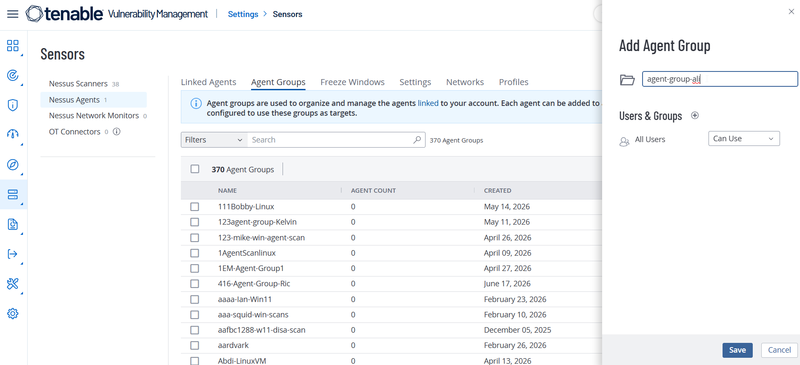
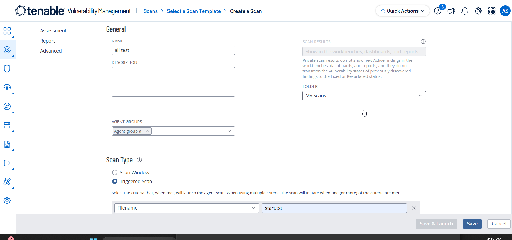
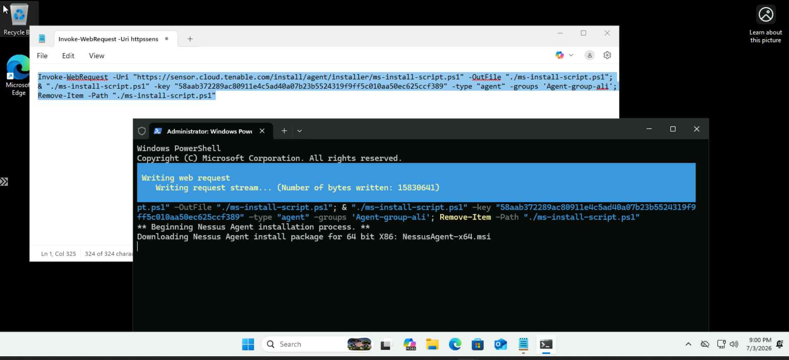
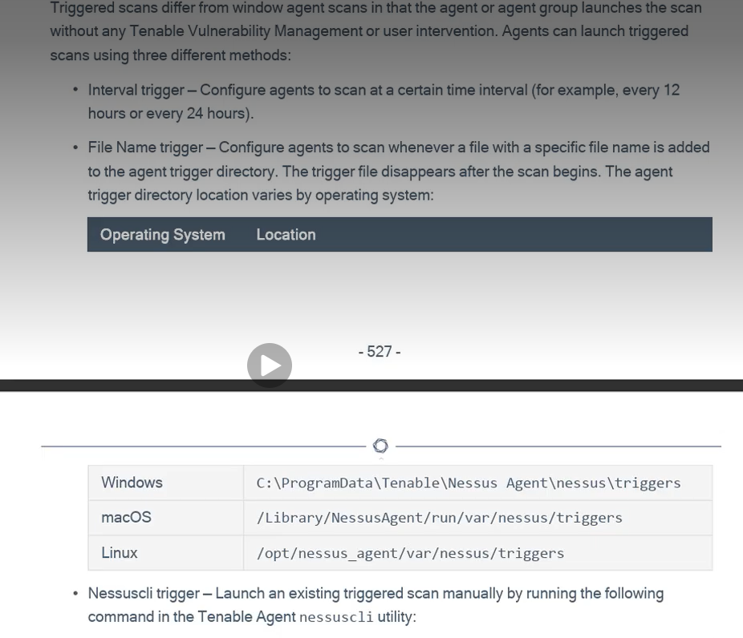
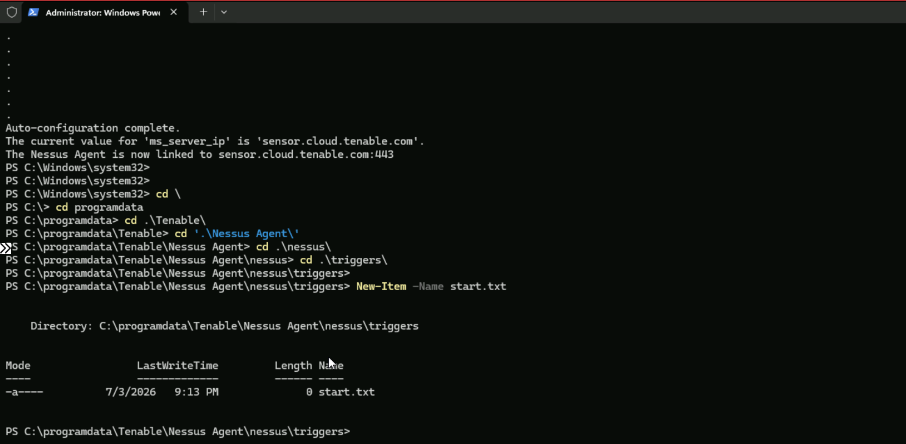
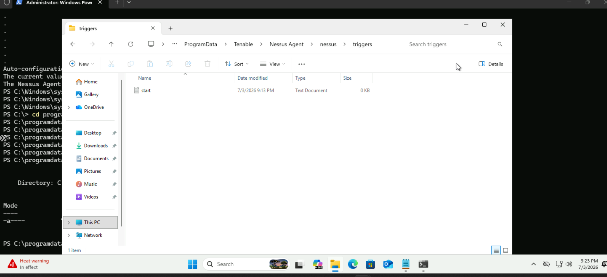
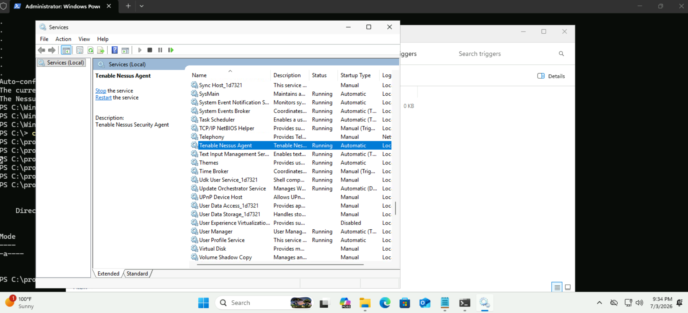
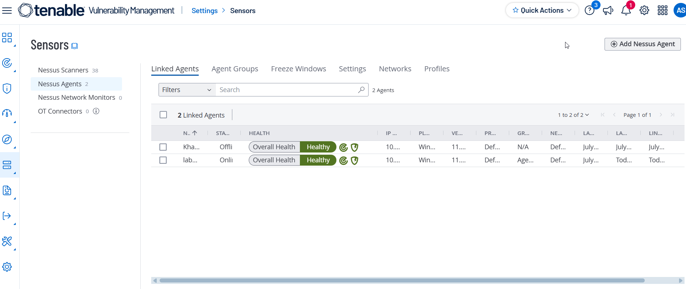

# Tenable Nessus Agent Triggered Scan Setup

This guide demonstrates how to deploy a **Nessus Agent** on a Windows virtual machine, link it to a **Tenable Agent Group**, configure a **Triggered Agent Scan**, and verify that the scan executes successfully.


# Prerequisites

- Windows 11 Virtual Machine (`VM-11`)
- Access to the Tenable Cloud Portal
- PowerShell with Administrator privileges
- Internet connectivity


# Step 1: Create the Windows Virtual Machine

Create a **Windows 11** virtual machine (`VM-11`) that will be used for installing the Nessus Agent.

---

# Step 2: Create a Nessus Agent Group

1. Log in to the **Tenable Cloud Portal**.
2. Navigate to:

```
Settings
    └── Sensors
            └── Nessus Agents
                    └── Agent Groups
```

3. Click **Add Agent Group**.
4. Enter a name for the agent group (e.g., `Agent-group-ali`).
5. Save the group.

> **Figure 1:** Creating a Nessus Agent Group


---

# Step 3: Create a Triggered Nessus Agent Scan

Navigate to:

```
Scans
    └── Create Scan
            └── Nessus Agent
                    └── Basic Agent Scan
```

Configure the scan with the following settings:

| Setting | Value |
|---------|-------|
| Agent Group | Select the Agent Group created in Step 2 |
| Scan Type | Triggered Scan |
| Trigger File Name | `start.txt` |

Click **Save**.

> **Figure 2:** Creating the Triggered Agent Scan



---

# Step 4: Obtain the Nessus Agent Installation Command

Navigate to:

```
Settings
    └── Sensors
            └── Nessus Agents
                    └── Linked Agents
                            └── Add Nessus Agent
```

Select:

- **Platform:** Windows

Copy the generated PowerShell installation command.

Example:

```powershell
Invoke-WebRequest -Uri "https://sensor.cloud.tenable.com/install/agent/installer/ms-install-script.ps1" -OutFile "./ms-install-script.ps1"; & "./ms-install-script.ps1" -key "58aab372289ac80911e4c5ad40a07b23b5524319f9ff5c010aa50ec625ccf389" -type "agent" -name "<agent name>" -groups '<list of groups>'; Remove-Item -Path "./ms-install-script.ps1"
```

> **Figure 4:** Copying the Agent Installation Command



---

# Step 5: Modify the Installation Script

Paste the copied script into **Notepad** and make the following changes:

- Remove:

```text
-name "<agent name>"
```

- Replace:

```text
-groups '<list of groups>'
```

with your own agent group.

Example:

```powershell
Invoke-WebRequest -Uri "https://sensor.cloud.tenable.com/install/agent/installer/ms-install-script.ps1" -OutFile "./ms-install-script.ps1"; & "./ms-install-script.ps1" -key "58aab372289ac80911e4c5ad40a07b23b5524319f9ff5c010aa50ec625ccf389" -type "agent" -groups 'Agent-group-ali'; Remove-Item -Path "./ms-install-script.ps1"
```
---

# Step 6: Install the Nessus Agent

1. Open **PowerShell** as Administrator.
2. Paste the modified script.
3. Execute the command.

The installation process will automatically:

- Download the Nessus Agent
- Install the agent
- Link it to your Tenable account
- Associate it with the specified Agent Group

---

# Step 7: Trigger the Local Agent Scan

Navigate to the trigger directory:

```powershell
cd "C:\ProgramData\Tenable\Nessus Agent\nessus\triggers"
```

> **Figure 7:** Navigating to the Trigger directory

Create the trigger file:

```powershell
New-Item -Name start.txt
```

This creates the trigger file that initiates the configured **Triggered Scan**.


> **Figure 7:** Creating the Trigger File


> **Figure 8:** text File shown in the explorer.
---

# Step 8: Verify the Scan Has Started

Observe the trigger directory.

Once the file:

```
start.txt
```

automatically disappears, it indicates that the Nessus Agent has detected the trigger and the local vulnerability scan has begun.


> **Figure 8:** the scan has begun


---

# Step 9: Verify the Agent in the Tenable Portal

Navigate to:

```
Settings
    └── Sensors
            └── Nessus Agents
```

Locate your newly linked agent.

Verify:

- Agent Name
- Agent Group
- Linked On Date
- Status

> **Note:** If the agent does not appear immediately, wait several minutes. In some environments, it may take up to **30 minutes** for the agent to register.

> **Figure 9:** Linked Nessus Agent



---

# Step 10: Verify the Triggered Scan

Navigate to:

```
Scans
```

Open the scan created in **Step 3**.

Confirm that:

- The scan was executed.
- The trigger file is listed as:

```
start.txt
```

- The scan completed successfully.

---

# Verification Checklist

| Task | Status |
|------|--------|
| Windows VM Created | ✅ |
| Agent Group Created | ✅ |
| Triggered Scan Configured | ✅ |
| Nessus Agent Installed | ✅ |
| Trigger File Created | ✅ |
| Trigger File Removed Automatically | ✅ |
| Agent Visible in Tenable | ✅ |
| Triggered Scan Executed Successfully | ✅ |

---

# Conclusion

The Nessus Agent has been successfully:

- Installed on the Windows virtual machine.
- Linked to the Tenable Cloud Portal.
- Assigned to the appropriate Agent Group.
- Configured to execute a Triggered Agent Scan.
- Verified through the Tenable Portal after successfully processing the `start.txt` trigger file.
